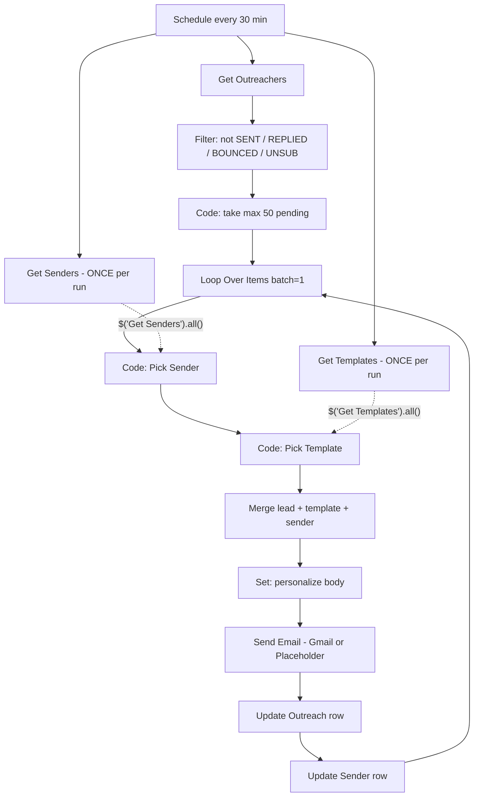

# Production Cold Email Outreach Workflow (n8n)

**Version:** 1.0  
**Date:** 2026-05-21  
**Purpose:** Is file ko **source of truth** samjho. Future mein apna n8n workflow is se **node-by-node match** karo. Credentials client se baad mein lagengi — pehle structure + rules.

**Scale target:** 4000+ outreach, 20 senders (expandable)  
**Principles:** Sheets + n8n, batching, idempotency, no over-engineering (no DB, no microservices, no 20 duplicate workflows)

---

## 1. Kaise match karein (checklist)

Har review par yeh table bharo:

| # | Production rule | Mera workflow mein? (Y/N) | Notes |
|---|-----------------|---------------------------|-------|
| 1 | Schedule Trigger (manual sirf test) | | |
| 2 | Outreach read → sirf non-sent filter | | |
| 3 | Har run max 50 leads (batch cap) | | |
| 4 | Senders sheet **loop ke andar har item par dubara read NAHI** | | |
| 5 | Templates sheet **loop ke andar har item par dubara read NAHI** | | |
| 6 | Pick Sender: `Sent_Today < Daily_Limit`, lowest first | | |
| 7 | Send ke **turant baad** Outreach → `SENT` + `sent_at` | | |
| 8 | Send ke **turant baad** Sender → `Sent_Today + 1` | | |
| 9 | Fail par Outreach → `FAILED` (retry limit optional) | | |
| 10 | Loop wapas `Loop Over Items` par close | | |
| 11 | `Send Status` column bina trailing space | | |
| 12 | Gmail/Send: To, Subject, Body set | | |
| 13 | Har sender = apni Gmail credential (ya 1 API tool) | | |
| 14 | Switch `={{ }}` syntax (not `=={{`) | | |
| 15 | Workflow `active: true` production par | | |

**Match score:** 15/15 = production-ready structure. Credentials alag checklist (section 8).

---

## 2. Architecture (high level)



**Ek execution mein:** max 50 emails. 4000 leads ≈ 80 runs ≈ ~40 hours @ 30 min schedule (adjust caps as needed).

---

## 3. Google Sheet contract (1 spreadsheet, 3 tabs)

### Tab: `Outreachers`

| Column | Type | Required | Notes |
|--------|------|----------|-------|
| `Email` | email | yes | Unique key for update |
| `Name` | text | no | `{Name}` replacement |
| `Send Status` | text | yes | `PENDING` \| `SENT` \| `FAILED` \| `REPLIED` \| `BOUNCED` \| `UNSUB` |
| `sent_at` | datetime | no | Fill on success |
| `assigned_sender` | email | no | Fill on success |
| `error_message` | text | no | Fill on fail |
| `campaign_step` | number | no | Default `1` (future follow-ups) |

**Rules:**
- Naya lead = `PENDING` (or empty → treat as pending in If)
- Kabhi bhi send without checking status
- Column name **exact** — trailing space mat rakho (`Send Status ` ❌)

### Tab: `Senders`

| Column | Type | Required | Notes |
|--------|------|----------|-------|
| `Email` | email | yes | Sender inbox |
| `Sent_Today` | number | yes | Default `0` |
| `Daily_Limit` | number | yes | e.g. `40` warm, `150` mature |
| `active` | text/bool | yes | `TRUE` / `FALSE` |
| `last_used_at` | datetime | no | Optional audit |

**Rules:**
- Midnight reset: alag chhoti workflow (Schedule 00:05 → Update all `Sent_Today` to 0) — Phase 2, ab optional
- Pick sender sirf `active=TRUE` aur `Sent_Today < Daily_Limit`

### Tab: `Templates` (Sheet3 rename recommended)

| Column | Type | Required |
|--------|------|----------|
| `Subject` | text | yes |
| `Body` | text | yes |

**Rules:**
- `{Name}` placeholder body mein
- Random 1 template per email (execution ke andar `$('Get Templates').all()` se)

---

## 4. n8n nodes — exact order & settings

> **Credential slots:** Abhi khali / placeholder. Client credentials baad mein same nodes par connect.

### Node 1: `Schedule Trigger`

| Setting | Value |
|---------|--------|
| Trigger | Schedule |
| Interval | Every **30** minutes |
| Production | Workflow **Active = ON** |

Manual Trigger sirf **copy test** workflow ke liye — production file mein Schedule hi ho.

---

### Node 2: `Get Outreachers`

| Setting | Value |
|---------|--------|
| Type | Google Sheets → Get row(s) |
| Document | Leads spreadsheet ID |
| Sheet | `Outreachers` |
| Credential | `Google Sheets OAuth2` (client) |

---

### Node 3: `Filter Not Sent`

| Setting | Value |
|---------|--------|
| Type | IF |
| Condition 1 | `Send Status` **not equals** `SENT` |
| Condition 2 | **not equals** `REPLIED` |
| Condition 3 | **not equals** `BOUNCED` |
| Condition 4 | **not equals** `UNSUB` |
| Combinator | AND |

Optional: empty status allow — `OR` group: status empty OR equals `PENDING`.

---

### Node 4: `Limit Batch 50`

| Setting | Value |
|---------|--------|
| Type | Code (JavaScript) |

```javascript
// Limit Batch 50 — 2026-05-21
const MAX = 50;
const rows = items.map(i => i.json);
const batch = rows.slice(0, MAX);
if (batch.length === 0) {
  return []; // stops run — nothing to do
}
return batch.map(json => ({ json }));
```

---

### Node 5: `Get Senders` (ONCE — Schedule se parallel)

| Setting | Value |
|---------|--------|
| Type | Google Sheets → Get row(s) |
| Sheet | `Senders` |
| Connect from | **Schedule Trigger** (Outreach chain se alag branch) |

⚠️ **Galat:** Loop ke andar Get Senders (har email par full read = scale fail).

---

### Node 6: `Get Templates` (ONCE — Schedule se parallel)

| Setting | Value |
|---------|--------|
| Type | Google Sheets → Get row(s) |
| Sheet | `Templates` |
| Connect from | **Schedule Trigger** |

---

### Node 7: `Loop Over Items`

| Setting | Value |
|---------|--------|
| Type | Split In Batches |
| Batch Size | `1` |
| Input from | `Limit Batch 50` |

**Loop close:** Last node (`Update Sender`) → wapas `Loop Over Items` input.

---

### Node 8: `Pick Sender` (Code — loop ke andar)

```javascript
// Pick Sender — 2026-05-21
const senders = $('Get Senders').all().map(i => i.json);
const available = senders.filter(s => {
  const active = String(s.active || 'TRUE').toUpperCase() === 'TRUE';
  const sent = parseInt(s.Sent_Today, 10) || 0;
  const limit = parseInt(s.Daily_Limit, 10) || 40;
  return active && sent < limit;
});
if (available.length === 0) {
  throw new Error('All senders at daily limit. Next run tomorrow or raise limit.');
}
available.sort((a, b) => (parseInt(a.Sent_Today, 10) || 0) - (parseInt(b.Sent_Today, 10) || 0));
return [{ json: available[0] }];
```

---

### Node 9: `Pick Template` (Code — loop ke andar)

```javascript
// Pick Template — 2026-05-21
const templates = $('Get Templates').all().map(i => i.json);
if (!templates.length) throw new Error('No templates in sheet');
const t = templates[Math.floor(Math.random() * templates.length)];
const bodyHtml = (t.Body || '').replace(/\n/g, '<br>');
return [{
  json: {
    subject: t.Subject || '',
    body: bodyHtml,
  },
}];
```

---

### Node 10: `Merge Lead + Sender + Template`

| Setting | Value |
|---------|--------|
| Type | Merge |
| Mode | Combine |
| Combine by | **Position** (ya Append with careful ordering) |

**Inputs:**
- Input 0: current lead (from Loop)
- Input 1: `Pick Sender` output
- Input 2: `Pick Template` output  

*Agar 2 Merge nodes chahiye pehle lead+sender, phir +template — theek hai, over-engineering nahi.*

---

### Node 11: `Personalize Body`

| Setting | Value |
|---------|--------|
| Type | Set (Edit Fields) |

| Field | Expression |
|-------|------------|
| `body` | `={{ ($json.body || "").replace("{Name}", ($json.Name || "").trim() || "there") }}` |
| `to_email` | `={{ $json.Email }}` |
| `from_email` | `={{ $json.Email }}` ← sender row email (Pick Sender merged) |

Sender merge ke baad field names align karo — sender column `Email` ho to expression:

`from_email` = `={{ $('Pick Sender').item.json.Email }}` if needed.

---

### Node 12: `Send Email`

**Testing (no client credential):**

| Setting | Value |
|---------|--------|
| Type | Code (placeholder) |

```javascript
// PLACEHOLDER — replace with Gmail when client cred ready — 2026-05-21
const lead = $('Loop Over Items').item.json;
const sender = $('Pick Sender').item.json;
return [{
  json: {
    ...items[0].json,
    send_simulated: true,
    would_send_from: sender.Email,
    would_send_to: lead.Email || items[0].json.to_email,
    subject: items[0].json.subject,
  },
}];
```

**Production (client credential):**

| Setting | Value |
|---------|--------|
| Type | Gmail → Send a message |
| To | `={{ $json.to_email || $json.Email }}` |
| Subject | `={{ $json.subject }}` |
| Message | HTML `={{ $json.body }}` |
| Credential | **Us sender ki Gmail** jiska email `Pick Sender` ne choose kiya |

**20 sender routing (simple → scalable):**

| Approach | When |
|----------|------|
| **A)** Switch node: 20 rules `Pick Sender.Email` equals → 20 Gmail nodes | Abhi 20 Gmail client de — works, maintain heavy |
| **B)** Cold email API (1 HTTP node) | Future jab 20 OAuth mushkil ho — Phase 2 |

Is spec mein **A** default hai (aapke direction ke mutabiq). Har Switch output = 1 Gmail node = 1 unique OAuth credential.

Switch rule example (repeat per sender):

```
leftValue:  ={{ $('Pick Sender').item.json.Email }}
operator: equals
rightValue: sender1@domain.com
```

❌ `=={{` mat use karo.

---

### Node 13: `Update Outreach SENT`

| Setting | Value |
|---------|--------|
| Type | Google Sheets → Update row |
| Sheet | `Outreachers` |
| Match column | `Email` |
| Match value | `={{ $('Loop Over Items').item.json.Email }}` |
| Update fields | `Send Status` = `SENT`, `sent_at` = `={{ $now.toISO() }}`, `assigned_sender` = `={{ $('Pick Sender').item.json.Email }}`, `error_message` = empty |

**Order:** Send **success** ke baad hi. Fail branch alag (Node 15).

---

### Node 14: `Update Sender Counter`

| Setting | Value |
|---------|--------|
| Type | Google Sheets → Update row |
| Sheet | `Senders` |
| Match column | `Email` |
| Match value | `={{ $('Pick Sender').item.json.Email }}` |
| Update | `Sent_Today` = `={{ (parseInt($('Pick Sender').item.json.Sent_Today, 10) || 0) + 1 }}` |

Phir → connect to **`Loop Over Items`** (next item).

---

### Node 15: `On Send Error` (optional minimal)

| Setting | Value |
|---------|--------|
| Type | Error Trigger **ya** Gmail node "Continue On Fail" + IF |

On fail → Update Outreach: `Send Status` = `FAILED`, `error_message` = `={{ $json.error }}`  
→ **do not** increment `Sent_Today`  
→ loop continue.

---

## 5. Connections map (text)

```
Schedule Trigger
├── Get Outreachers → Filter Not Sent → Limit Batch 50 → Loop Over Items
├── Get Senders
└── Get Templates

Loop Over Items (output 2 / "loop")
  → Pick Sender → Pick Template → Merge → Personalize → Send Email
  → Update Outreach SENT → Update Sender Counter → Loop Over Items (loop back)

Loop Over Items (output 1 / "done")
  → (optional) No Op / log "Batch complete"
```

---

## 6. Throughput math (production planning)

```
emails_per_day ≈ SUM(each sender Daily_Limit)
例: 20 senders × 40/day = 800/day
4000 pending ≈ 5 days
```

Schedule 30 min + batch 50 = max **2400/day theoretical** — sender caps real limit hain. **Daily_Limit** sheet par real values rakho.

---

## 7. Purana workflow vs production (gap list)

| Tumhara purana flow | Production spec |
|---------------------|-----------------|
| Manual Trigger | Schedule Trigger |
| No update after send | Nodes 13 + 14 required |
| Get Templates inside loop | Get Templates once (Node 6) |
| Get Senders inside loop | Get Senders once (Node 5) |
| 4000 items one run | Limit Batch 50 |
| 2 Switch routes | 20 routes OR API Phase 2 |
| Same Gmail cred on 2 nodes | 1 cred per sender |
| `Send Status ` (space) | `Send Status` |
| Loop done not wired | Loop close after Node 14 |

---

## 8. Credentials (client se — baad mein)

| Credential | Count | Used on |
|------------|-------|---------|
| Google Sheets OAuth2 | 1 | Get/Update all sheet nodes |
| Gmail OAuth2 | 20 (or 1 API) | Send Email per sender |

**Testing without client:** Node 12 = Code placeholder (section 4). Baaki sheet nodes client sheet ID ke bina test nahi — structure phir bhi match karo.

---

## 9. Intentionally NOT in scope (over-engineering)

- PostgreSQL / Redis / queue service  
- AI personalization  
- 20 separate n8n workflows  
- Real-time reply ML  
- Multi-step drip (Phase 2: `campaign_step` column ready rakha hai)  
- Midnight reset workflow (Phase 2 — section 3 note)

---

## 10. Phase 2 (future — same file update karna)

1. `Reset Sent_Today` — daily Schedule 00:05  
2. Reply webhook / Gmail trigger → `REPLIED`  
3. Follow-up: `campaign_step = 2` + `followup_due` date  
4. Instantly/Smartlead → Switch 20 Gmail ko replace

---

## 11. File history

| Date | Change |
|------|--------|
| 2026-05-21 | v1.0 — Initial production spec |

---

**Roman Urdu summary:** Yeh file tumhara **naksha** hai. Credentials baad mein. Pehle nodes 1–14 + checklist 15/15 match karo — direction sahi, production tabhi jab **send ke baad sheet update** aur **batch 50** dono hon.
